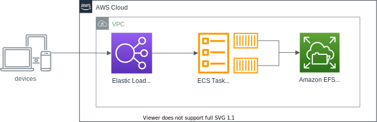

# Deploy vaultwarden on AWS

This is a sample project for CDK deployment.

[vaultwarden](https://github.com/dani-garcia/vaultwarden) is alternative implementation of the Bitwarden server API written in Rust.


## Architecture


## Prepare
```bash
$ npm i -g aws-cdk
```

## SSL and Custom Domain
If you want to use your domain and ssl, you can use route 53 and amazon certificate manager.
You have to edit following code, in [lib/vaultwarden-on-aws-stack.ts](https://github.com/drskur/vaultwarden-on-aws/blob/main/lib/vaultwarden-on-aws-stack.ts)
```typescript
    // exist resources: please use your resources.
    const certificate = Certificate.fromCertificateArn(this, 'Cert', 'arn:aws:acm:ap-northeast-2:XXXXXXXXX:certificate/ID');
    const domainZone = HostedZone.fromLookup(this, 'Zone', { domainName: 'example.com' });
    const domainName = 'vaultwarden.example.com';
    const ecsService = new ApplicationLoadBalancedFargateService(this, "vaultwarden-service", {
      cluster,
      certificate,
      domainZone,
      domainName,
      sslPolicy: SslPolicy.RECOMMENDED,
      redirectHTTP: true,
      desiredCount: 1,
      taskImageOptions: {
        image: ContainerImage.fromRegistry('vaultwarden/server'),
      },
      cpu: 512,
      memoryLimitMiB: 1024,
    });
```


## Deploy
```bash
$ cdk deploy
```